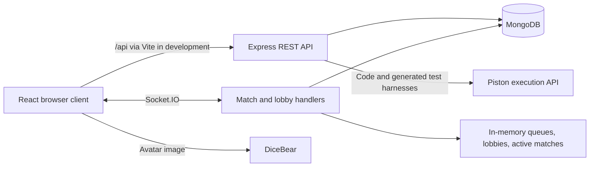

# CodeDuel

CodeDuel is a browser-based, one-on-one coding duel application for programmers who want to practice solving problems against another player. A React client provides accounts, matchmaking, a JavaScript editor, and custom rooms; an Express/Socket.IO server coordinates matches, stores data in MongoDB, and sends code to Piston for execution. Ranked progression and some custom-match rules have implementation gaps documented below.

## Features

- Registration and login with hashed passwords and JWT authentication; username editing and the latest 20 matches on the account page.
- Ranked matchmaking that pairs the first two queued sockets, gives both players the same randomly selected problem, and targets five round wins.
- Monaco editor with JavaScript execution, test-case submission results, and an opponent typing/code-structure display.
- Custom problem authoring and saved room templates with up to five rounds, room codes, and optional passwords. Matches start when two players join.
- Public waiting-room browsing and spectator access before a custom match starts; spectators receive players' source code live.
- Browser-side focus and paste-detection rules that can forfeit a match; disconnects also end a player's active match.

## Tech stack

Versions below are the declared package ranges, not a reproducible dependency lock.

| Layer | Technology |
| --- | --- |
| Language | JavaScript; JSX in the client, CommonJS in the server |
| Client | React `^19.1.1`, React Router `^7.9.1`, Vite `^7.1.2` |
| UI | Tailwind CSS `^3.4.17`, Monaco React `^4.7.0`, React Icons |
| HTTP and realtime | Axios, Express `^5.1.0`, Socket.IO/client `^4.8.1` |
| Persistence | MongoDB through Mongoose `^8.18.1` |
| Authentication | bcryptjs `^3.0.2`, jsonwebtoken `^9.0.2` |
| Development | ESLint 9, nodemon, dotenv, PostCSS/Autoprefixer |
| External services | Piston execution API; DiceBear Bottts SVG avatars on the account page |

## Project structure

```text
.
├── .gitignore                 # Ignores secrets, dependencies, and builds
├── client/
│   ├── package.json           # Dev, build, lint, and preview scripts
│   ├── vite.config.js         # /api proxy to localhost:5000
│   ├── eslint.config.js       # Client lint rules
│   ├── tailwind.config.js
│   ├── public/                # Logo and static assets
│   └── src/
│       ├── main.jsx           # React entry point
│       ├── App.jsx            # Browser routes and socket lifecycle
│       ├── socket.js          # Shared Socket.IO client
│       └── pages/             # Auth, profile, lobby, arena, and custom rooms
└── server/
    ├── package.json           # Start, dev, and database seed scripts
    ├── server.js              # HTTP server, matchmaking, and socket handlers
    ├── routes/                # REST route definitions
    ├── controllers/           # Auth, profile, execution, templates, and history
    ├── middleware/            # Bearer-token authentication
    ├── models/                # User, Problem, CustomProblem, RoomTemplate, Match
    └── data/                  # Two alternative problem seed datasets
```

## Architecture overview



Express and Socket.IO share the HTTP server in `server/server.js`. MongoDB stores accounts, standard/custom problems, templates, and completed matches. Queues, active matches, and lobbies exist only in that process and are lost on restart.

The client keeps its JWT in `localStorage` and sends it as a Bearer token for protected HTTP requests. Socket connections do not authenticate that token. After a successful HTTP submission, the browser emits `round_won`; the socket handler does not independently verify the submission.

## Prerequisites

- Node.js and npm. The locally installed Vite 7.1.5 declares Node `^20.19.0 || >=22.12.0`. **TODO: confirm** the project's supported Node/npm versions; neither package declares `engines` and no runtime version file is committed.
- An accessible MongoDB database. **TODO: confirm** the supported MongoDB version; none is pinned.
- Network access from the server to `https://emkc.org/api/v2/piston/execute` for running/submitting code. The controller hardcodes runtime version `18.15.0` and sends no API credentials. **TODO: confirm** that this endpoint permits these requests and provides that runtime in the intended environment.
- A browser for the client, with separate browser profiles or devices for two-player testing.

## Installation and setup

There is no root package or workspace runner. From the repository root, install each package separately:

```sh
cd server
npm ci
cd ../client
npm ci
cd ..
```

On Windows PowerShell, if execution policy blocks `npm.ps1`, use `npm.cmd` in place of `npm` in these commands.

Create one `.env` at the repository root with the variables below. It stays gitignored; do not commit credentials. The server and both seed scripts load it through explicit paths relative to their source files, independently of the working directory. Compose reads the same root file and requires a nonempty `MONGO_URI`. Environment variables already supplied to the process take precedence.

To populate a development database, choose **one** seed command. **Both delete every existing standard `Problem` document before inserting their dataset.** They do not merge datasets or import from LeetCode, and they do not delete users, templates, custom problems, or match history.

From `server/`, the minimal dataset contains Two Sum and Palindrome Number:

```sh
npm run seed
```

Alternatively, the larger dataset contains 15 LeetCode-style problems:

```sh
npm run seed:leetcode
```

The larger dataset contains incompatible expected-output formatting for some problems; see known issues. Standard matchmaking requires a nonempty problem collection, and round advancement needs a problem other than the current one.

## Environment variables

The root `.env` is the only environment file. Set these names; never commit real credentials.

| Name | Description | Required/optional |
| --- | --- | --- |
| `MONGO_URI` | MongoDB URI shared by local Node, seed scripts and Compose. Include the intended database name; an omitted name defaults to `test`. | Required |
| `JWT_SECRET` | Long random signing secret shared by local and Docker runs. | Required |
| `PISTON_URL` | Full execution endpoint; defaults to `https://emkc.org/api/v2/piston/execute`. Must accept unauthenticated requests with runtime `18.15.0`. | Optional |
| `CLIENT_ORIGIN` | Allowed REST and Socket.IO browser origin. Use `http://localhost:8080` for default Docker ports or `http://localhost:5173` for local Vite. | Set to match the browser URL |
| `WEB_PORT` | Published nginx port; defaults to 8080. | Optional, Compose only |
| `BACKEND_PORT` | Published backend debug port on host loopback; defaults to 5000. | Optional, Compose only |
| `PORT` | Local backend listening port; defaults to 5000. Compose fixes the container port at 5000. | Optional |

Local Vite API proxy and socket connections target backend port 5000. Production sockets use the browser origin through nginx. Changing a host port requires updating `CLIENT_ORIGIN` to match the frontend URL.

## Usage / running the project

Start the backend in one terminal, from the repository root:

```sh
cd server
npm run dev
```

Start the frontend in a second terminal, from the repository root:

```sh
cd client
npm run dev
```

Use `http://localhost:5173` with the default development setup and set `CLIENT_ORIGIN=http://localhost:5173` in the root `.env`. The Vite `/api` proxy forwards HTTP requests to `http://localhost:5000`; sockets connect directly to that backend.

Register at `/register`, then use `/lobby` to queue with a second user. Use `/custom/create` to author problems and templates, and `/custom` to browse or join rooms by code. A spectator must join while the room is waiting, before the second player starts the match. `/account` supports username editing and match history; `/battle` expects match data supplied by navigation from matchmaking.

During a battle, switching tabs or losing window focus triggers a forfeit. Large/rapid editor insertions also trigger a forfeit, so pasting solutions or using two tabs in one browser is unsuitable for normal match testing.

For custom test cases, `input` is a string containing JavaScript call arguments, and `output` must match the exact `JSON.stringify` result. For example, Two Sum uses input `[2,7,11,15], 9` and output `[0,1]`. The harness extracts a named `function` declaration from `starterCode`, falling back to `solution`, and calls it with those arguments. Each test case is executed in a separate remote request.

## API and realtime reference

All HTTP paths below are relative to the backend origin. Request bodies are JSON. Protected routes require `Authorization: Bearer <token>`.

| Method | Path | Auth | Request / behavior |
| --- | --- | --- | --- |
| POST | `/api/auth/register` | No | `username`, `email`, `password`; returns user identifiers and a token. |
| POST | `/api/auth/login` | No | `email`, `password`; returns user identifiers and a token. |
| GET | `/api/auth/me` | Yes | Returns the current user without the password field. |
| PUT | `/api/users/profile` | Yes | Updates `username`; returns `_id`, `username`, `email`. |
| POST | `/api/code/execute` | No | `code`, `language`; returns `output`. Language defaults to JavaScript in the runner. |
| POST | `/api/code/submit` | No | `code`, `language`, `problemId`; returns `success` and test `results` containing `id`, `passed`, `input`, `expected`, `actual`. |
| POST | `/api/custom/problem` | Yes | Creates a problem with `title`, `description`, `starterCode`, `testCases` (`input`/`output` strings). |
| GET | `/api/custom/problems` | Yes | Lists the current user's custom problems. |
| POST | `/api/custom/template` | Yes | Creates a template from `name`, `password`, `rounds`, `timeLimit`, `problemIds`. |
| GET | `/api/custom/templates` | Yes | Lists the current user's templates with populated problems. |
| PUT | `/api/custom/template/:id` | Yes | Replaces the above template fields; requires ownership. |
| DELETE | `/api/custom/template/:id` | Yes | Deletes an owned template. |
| GET | `/api/matches/history` | Yes | Returns the user's latest 20 matches, newest first. |

The arena sends only `javascript`; the submission harness is JavaScript-specific despite the API accepting a `language` field.

Client-to-server Socket.IO events, as implemented in `server/server.js`:

| Event | Payload / behavior |
| --- | --- |
| `find_match` | `{ userId, username, rank }`; joins the FIFO queue. |
| `get_rooms` | No payload; broadcasts the public waiting-room list. |
| `create_custom_room` | `{ templateId, isPublic, name, userData }`; `userData` contains `userId`, `username`, optional `rank`. Without a template, selects a standard problem. |
| `join_custom_room` | `{ roomId, password, role, userData }`; role is `player` or `spectator`. |
| `join_match_room` | Room ID string; subscribes the socket to match broadcasts. |
| `round_won` | Room ID string; advances the score/round or ends the match. |
| `forfeit_match` | Room ID string; ends the match as a disqualification. |
| `code_progress` | `{ roomId, structure, isTyping, code }`; forwards structure to the opponent and source to spectators. |
| `leave_room` | No payload; removes queue/lobby participation, deleting a hosted lobby. |

Server events are `rooms_update`, `custom_room_created`, `error_joining_room`, `lobby_update`, `match_found`, `round_update`, `match_over`, `opponent_progress`, and `spectator_feed`. Disconnect cleanup also removes queued/lobby participants and awards an active opponent the match.

## Testing

No automated test files, test scripts, or CI workflows are committed. The available client lint check is:

```sh
cd client
npm run lint
```

The documentation audit ran this check: it failed with three unused-variable errors (`err` in `CustomRoomDashboard.jsx` and `RoomBrowserPage.jsx`, and `lobbyCounts` in `LobbyPage.jsx`) and one missing-effect-dependency warning in `CustomRoomDashboard.jsx`.

Manual smoke checks should cover registration/login, username changes, a two-user ranked match, custom-room creation/joining, a spectator joining before match start, execution/submission, and match history. These flows were inspected in code but were not exercised against MongoDB or Piston during the documentation audit. Build and service startup commands were checked against package scripts, not executed.

## Deployment

With Docker Desktop running Linux containers, create the root `.env` using the variable table above, set a real `JWT_SECRET`, and run from the repository root:

```powershell
docker compose up --build
```

Open `http://localhost:8080`. The backend is exposed on `127.0.0.1:5000` for debugging. Default mode uses Atlas through `MONGO_URI` and starts only client and server. Allow the backend machine's outbound IP in Atlas Network Access and provide a database user with access to the intended database. The root environment file is outside both build contexts and is never copied into an image.

For optional local MongoDB 8, set `MONGO_URI=mongodb://mongo:27017/codeduel` in root `.env`, then run:

```powershell
docker compose --profile localdb up --build
```

The optional service uses `mongo_data`, is not published to the host, and runs with `--quiet` and a 30-second healthcheck. Volume declarations cannot have profiles; only the optional Mongo service uses this volume. Restore the Atlas `MONGO_URI` to switch back, and use `docker compose --profile localdb down` before changing modes to remove any previously running local container.

All healthchecks run every 30 seconds. Nginx omits access logs only for `/healthz`; ordinary access and error logs remain enabled. The backend healthcheck uses TCP and produces no HTTP request logs. Its healthcheck confirms a listening socket, not database connectivity; check the separate MongoDB connection message.

Choose only one seed command. From `server/`, run `npm run seed` or `npm run seed:leetcode`. In Docker, run `docker compose exec server npm run seed` or `docker compose exec server npm run seed:leetcode`. Both print the database name before writing, delete every standard Problem document, and then insert their dataset; other collections are untouched. These commands target the configured database, including Atlas, and must not be run casually against existing data.

Stop while retaining database data:

```powershell
docker compose down
```

To delete the database volume as well (destructive):

```powershell
docker compose down -v
```

Both package lockfiles must be present for the Dockerfiles' `npm ci` steps. The frontend uses a Node 20 build stage and nginx with SPA, API, and WebSocket routing. The backend runs as the unprivileged Node user. Piston remains external; no execution service is included. A new local database needs problem data before matchmaking works. The current in-memory match state assumes one backend process.

## Known issues and limitations

- **Ranked persistence is inconsistent with the schema.** `server/server.js` assigns ranks such as Bronze to `User.role`, but `server/models/user.model.js` permits only `user`, `admin`, and `developer`; `stats.rp` is absent from the schema. A ranked result is saved before these user updates, which can fail validation. The account page displays a fixed `BRONZE I` label. Matchmaking does not use rank to select opponents.
- **Match integrity relies on clients.** Socket identities come from user-supplied data; no socket authentication middleware is installed. Round wins are not tied to server-validated submissions, and room subscription/forfeit/progress handlers do not consistently enforce participation. Full problem documents, including test cases, are sent to players.
- **Execution endpoints are public.** There is no route authentication, explicit rate limiter, or Axios request timeout for Piston. Input validation is limited; an empty test-case list produces a successful submission without running code.
- **Custom-match outcomes can be wrong.** On the last problem, `round_won` chooses that event's socket as the winner instead of comparing total scores. **TODO: confirm** intended custom-match victory and tie rules.
- **Time limits are not enforced.** Template `timeLimit` is stored but not used by match logic. The arena counts down from 300 seconds without ending the match at zero or resetting the timer each round. **TODO: confirm** intended timer and timeout behavior.
- **Seed output mismatches.** Group Anagrams and Reverse String in `server/data/seedLeetCode.js` use single-quoted expected arrays, which cannot equal the harness's JSON-serialized arrays. Exact string comparison also rejects otherwise equivalent output orderings.
- **Template lifecycle gaps.** The UI collects a template description, but the create/update controllers omit it. Editing a template creates new custom-problem documents; deleting a template does not delete its problems. Room passwords are stored in plaintext, and socket-based template launching does not check template ownership.
- **Browser-only enforcement can misfire or be bypassed.** Focus changes and large/fast edits cause forfeits; these checks are not authoritative server controls. Active-match reconnection/resumption is not implemented.
- **Incomplete UI/integration.** The home page links to `/leaderboard`, but `client/src/App.jsx` has no such route. It advertises Python/C++/Java although the arena and harness use JavaScript. It also opens a second socket and emits `join_room`, which has no server handler. Avatar editing is deferred in a controller comment.
- **Operational gaps.** Database connection failures are logged while the HTTP server still starts. Several socket errors are only logged, and some async handlers lack local error handling. No migrations, health-check endpoint, automated tests, or CI are supplied. Both package lockfiles are available for version control and used by `npm ci`.
